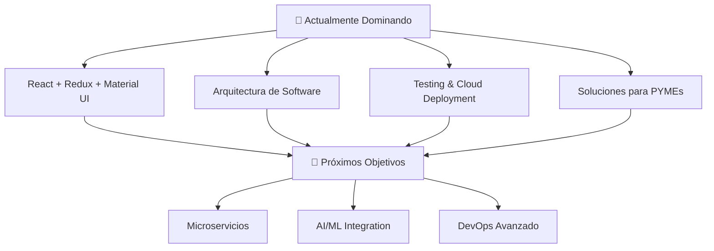

# enriquegiraldo# 🚀 Enrique Giraldo Puentes 👋
### `Full Stack Developer & Digital Solutions Architect`

<div align="center">
  
```ascii
    ╔══════════════════════════════════════════════════════════════╗
    ║  🌟 Transformando ideas en soluciones digitales robustas 🌟  ║ 
    ║              📍 Bogotá, Colombia 🇨🇴                        ║
    ╚══════════════════════════════════════════════════════════════╝
```

[](https://git.io/typing-svg)

</div>

---

## 🎯 **Mi Filosofía de Código**

> *"El código no es solo funcionalidad, es arte que resuelve problemas reales"*

```javascript
const enrique = {
  location: "Bogotá, Colombia 🇨🇴",
  current_focus: "Full Stack Development",
  learning_journey: {
    years: 4,
    approach: "autodidacta + formación intensiva",
    currently_studying: "Tecnólogo en Análisis y Desarrollo de Software - SENA"
  },
  passion: ["interfaces intuitivas", "desarrollo en la nube", "backend eficiente"],
  motto: "Transformar ideas en soluciones digitales robustas"
};
```

---

## 🛠️ **Arsenal Tecnológico**

### **Frontend Universe** 🎨
<p align="left">

</p>

### **Backend Powerhouse** ⚡
<p align="left">

</p>

### **Database Mastery** 🗄️
<p align="left">

</p>

### **Cloud & DevOps** ☁️
<p align="left">

</p>

---

## 📊 **Estadísticas de Batalla**

<div align="center">
  
  
</div>

<div align="center">
  
</div>

---

## 🎓 **Academia & Certificaciones**

### **Instituciones de Élite**
```
🏛️ SENA - Tecnólogo en Análisis y Desarrollo de Software
🎯 Oracle Next Education - Alura LATAM por 3 años 
🚀 Udemy - Formación Práctica Intensiva
📚 Platzi - Habilidades Técnicas Avanzadas
🏛️ Universidad de Caldo
🎓 Universidad Sergio Arboleda 
🏛️ Universidad Nacional de Colombia
📖 Coursera - Educación Continua
```

### **Especializaciones Cloud**
<div align="center">

| ☁️ **AWS** | ☁️ **Oracle Cloud** | ☁️ **Google Cloud** |
|------------|-------------------|-------------------|
| `Fundamentos sólidos` | `Oracle Cloud Infrastructure` | `Google Cloud Platform` |
| `Servicios core` | `Servicios empresariales` | `Arquitectura distribuida` |

</div>

---

## 🧠 **Laboratorio de Aprendizaje**



---

## 🤝 **Zona de Colaboración**

<div align="center">

### **🔥 Proyectos Que Me Emocionan**

| **Categoría** | **Tecnologías** | **Impacto** |
|---------------|----------------|-------------|
| 🎨 **Frontend** | `React` `JavaScript` `Material UI` | Interfaces que enamoran |
| ⚡ **Backend** | `Java` `Spring Boot` `Node.js` | Arquitecturas que escalan |
| 🌱 **Social Impact** | `Full Stack` | Educación & Comunidad |
| 🏢 **Business Solutions** | `Cloud Native` | Software para PYMEs |

</div>

---

## 🎨 **Portafolio Visual**

<div align="center">
  
### **🌟 Proyectos Destacados**

```
┌─────────────────────────────────────────────────────────────┐
│                    🚧 En Construcción 🚧                    │
│                                                             │
│  📱 App Mobile - React Native                              │
│  🌐 E-commerce Platform - MERN Stack                       │
│  ☁️ Cloud Microservices - Spring Boot                      │
│  🤖 AI Chat Assistant - Python + OpenAI                    │
│                                                             │
└─────────────────────────────────────────────────────────────┘
```

</div>

---

## 🏆 **Logros & Reconocimientos**

<div align="center">


</div>

---

## 🎵 **Soundtrack de Programación**

<div align="center">

> *"La música es el combustible del código"* 🎧

### 🎶 Géneros Favoritos
```diff
+ Deep Focus    + Synthwave    + Lo-Fi    + Classical    + Electronic
```

### 🚀 Playlists Recomendadas
[](https://open.spotify.com/playlist/37i9dQZF1DWWQRwui0ExPn?si=ada1f7e6a5b74c4c)
[](https://music.youtube.com)

### 🔊 Últimas Reproducciones
```ascii
┌──────────────────────────────────────────────┐
│  🎧  Deep Focus - Flow State (2h 45m)        │
│  ⚡  Synthwave Retro Vibes (1h 52m)          │
│  🎻  Classical Coding Sessions (3h 10m)      │
│  🌌  Space Ambient Explorer (4h 20m)         │
└──────────────────────────────────────────────┘
```

### 🎛️ Mi Configuración
```yaml
player: 
  - Spotify Premium
  - YouTube Music
equipo:
  - Headphones: Sony WH-1000XM5
  - Speakers: Edifier R1280DB
volumen: 75% # Nivel óptimo para concentración
```

</div>

---

## 🌐 **Conectemos y Creemos Juntos**

<div align="center">

### **🔗 Mis Territorios Digitales**

<p align="center">
<a href="mailto:enriquegiraldo@hotmail.es">
  
</a>
<a href="https://www.linkedin.com/in/enrique-giraldo-puentes-cc80123548/">
  
</a>
<a href="https://www.github.com/enriquegiraldo">
  
</a>
<a href="https://www.youtube.com/@Enrique_Giraldo_Puentes">
  
</a>
<a href="https://www.gitlab.com/enriquegiraldo">
  
</a>
</p>

</div>

---

## 📈 **Actividad Reciente**

<div align="center">
  
<!--START_SECTION:activity-->
<!--END_SECTION:activity-->

</div>

---

<div align="center">

[](https://github.com/enriquegiraldo)

</div>

